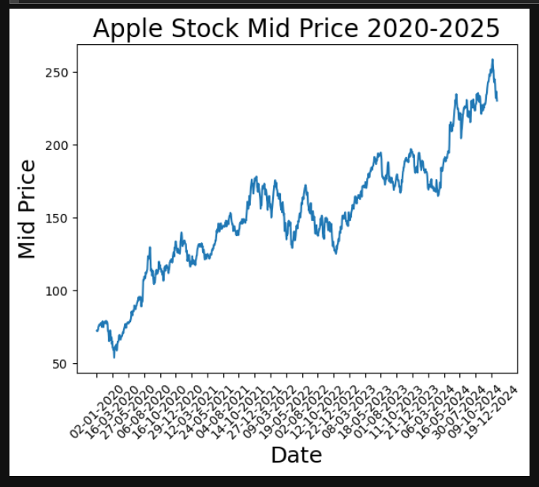
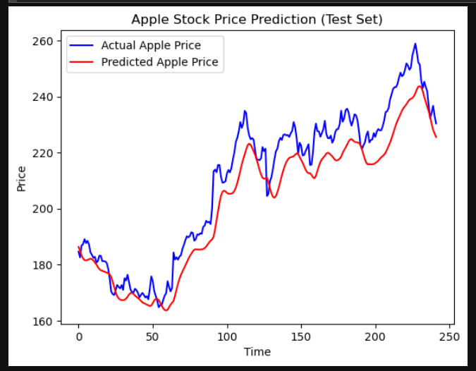
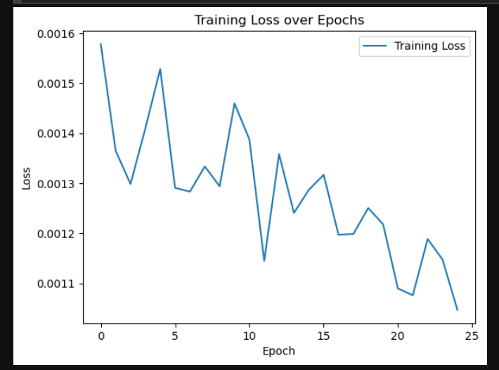

# Apple-Stock-LSTM-Prediction
Predicting Apple stock mid-prices (2020–2025) using stacked LSTM neural networks in Python

# Apple Stock LSTM Predictor

This project predicts Apple stock mid-prices from 2020 to 2025 using a stacked LSTM (Long Short-Term Memory) neural network in Python.

## Overview
- Preprocessed historical stock data (mid-prices)
- Created 60-day sequences for time-series prediction
- Built a stacked LSTM model with 70 units per layer
- Included Dropout layers to prevent overfitting
- Trained the model and visualized:
  - Training loss over epochs
  - Predicted vs actual mid-prices

## Key Learning
- Implemented deep learning for time-series forecasting
- Handled data normalization and sequence creation
- Applied LSTM to learn both short-term and long-term trends

## Tools & Libraries
Python, TensorFlow/Keras, Pandas, NumPy, Matplotlib, scikit-learn

## Repository
- Jupyter Notebook: `Apple_Stock_LSTM.ipynb`
- Requirements: `requirements.txt`

## Visualizations

### Mid-stock Prices

### Predicted vs Actual Prices

### Training Loss

## Model Rationale and Insights

I selected an LSTM network instead of linear regression or ARIMA because financial time series often display non-linear dynamics and long-term temporal dependencies that traditional models cannot capture. The model was trained on 60-day rolling windows to predict the next day’s price, with the dataset split chronologically to avoid data leakage from future data. The loss curve showed smooth exponential convergence, indicating strong learning stability. The LSTM effectively tracked underlying market trends and directionality, though it displayed minor lag during volatile periods—highlighting both its strength in pattern recognition and the inherent challenges of forecasting high-variance financial data.

